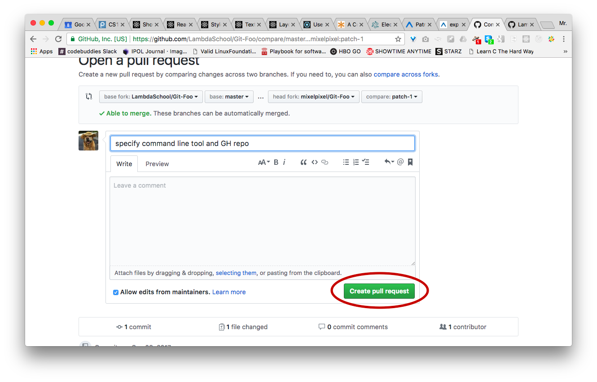
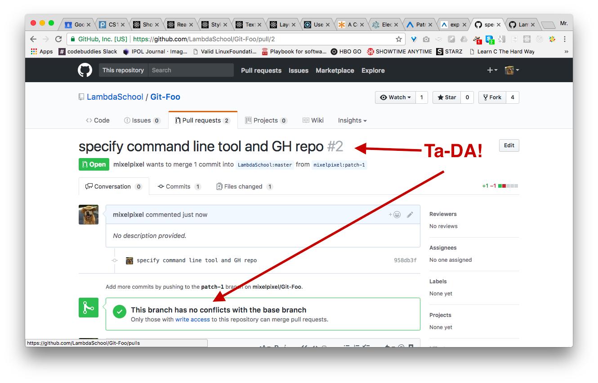

# Making a patch request on GitHub using the GH text editor
- for when you don't have Collaborator status
- e.g. if you want to submit a change to LambdaSchool if you've found a typo or a bug or something (not that LS ever publishes those on GH :P)

